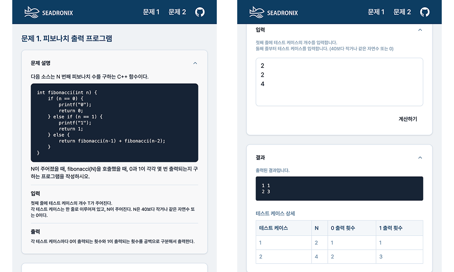
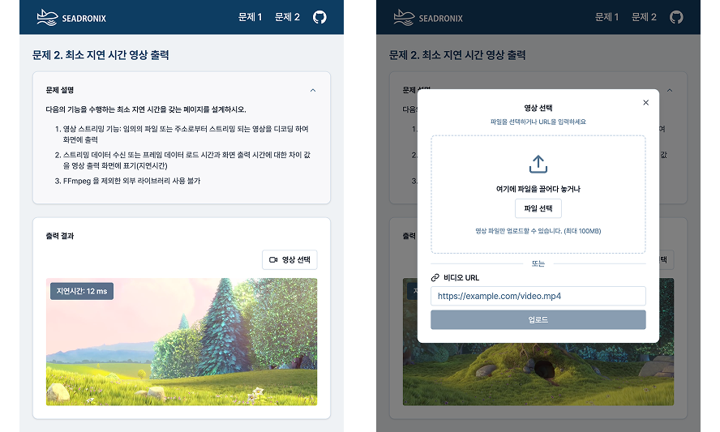

<h1 > 씨드로닉스 사전 과제</h1>
<h2 > 프론트엔드 강미정 </h2>

[jagarmj@gmail.com](mailto:jagarmj@gmail.com)

<br>

> 씨드로닉스 사전 과제를 기반으로 웹 애플리케이션을 구현했습니다.
> 각 문제에 대한 설명과 결과를 직관적으로 확인할 수 있도록 구성하였습니다.
> <br>  
> **[🔗 구현 페이지 바로가기](https://seadronix.vercel.app/)**

- [과제 내용](#과제-내용)
- [실행 방법](#실행-방법)
- [기술 스택](#기술-스택)
- [구현 상세](#구현-상세)
- [폴더 구조](#폴더-구조)

## 과제 내용

- **문제 1**: 피보나치 출력 횟수 계산

  - `/fibo` 페이지에서 테스트 케이스 개수(T)와 테스트 케이스(N)를 입력하여 결과를 확인할 수 있습니다.
    

<br>

- **문제 2**: 최소 지연 시간을 갖는 영상 스트리밍 페이지 설계
  - `/video` 페이지에서 파일을 업로드하거나 URL을 입력하여 영상을 재생하고, 지연 시간을 확인할 수 있습니다.
    

<br>

## 실행 방법

**1. 레파지토리 클론 및 해당 폴더 이동**

```bash
git clone https://github.com/snakechickensoup/seadronix

cd seadronix
```

**2. env 파일 설정**
❗ 실행하기 편하도록 env 파일 값을 설정해두었습니다.

```bash
# .env 파일 생성
echo "NEXT_PUBLIC_VIDEO_URL=https://commondatastorage.googleapis.com/gtv-videos-bucket/sample/BigBuckBunny.mp4" > .env
```

**3. 패키지 설치 및 실행**

```bash
# 패키지 설치
pnpm install

# 개발 서버 실행
# http://localhost:3000 에서 확인 가능합니다.
pnpm dev

```

<br>

## 기술 스택

- **환경**: `TypeScript`, `VSCode`, `Vercel`, `pnpm`
  <br>
- **스택**: `Next.js`, `Tailwind CSS`, `React Hook Form`

<br>

## 구현 상세

- **문제 1**

  - 사용자 경험을 고려한 UI/UX

    - 컴포넌트를 순차적으로 배치하여 입력과 결과 확인 흐름이 직관적으로 이어지도록 구성했습니다.
    - 결과를 즉시 확인할 수 있도록 값 입력 시 결과 영역의 아코디언이 열리도록 하여 피드백을 즉각적으로 제공합니다.
    - 테이블 형식으로 결과를 표시하여, 여러 테스트 케이스를 쉽게 파악하고 사용자의 이해를 도왔습니다.
      <br>

  - 입력 값 검증
    - 숫자가 아닌 값, 범위(0 ≤ N ≤ 40)를 벗어난 값, 테스트 케이스 개수(T)와 입력 개수 불일치 등 다양한 예외 상황을 고려하였습니다.
    - 각 오류에 대해 적절한 에러 메세지를 제공하여 사용자의 이해를 돕고, 잘못된 입력을 방지했습니다.
      <br>
  - 성능 개선
    - 재귀 호출로 인한 중복 계산을 방지하기 위해 메모이제이션 기법을 적용하여, O(N) 수준으로 시간복잡도를 개선하고 결과를 빠르게 도출합니다.
      <br>

- **문제 2**

  - 브라우저환경에서의 최소 지연 시간 구현
    - 초기에는 FFmpeg.wasm 기반 방식을 사용했으나, 예상보다 지연 시간이 길어 과제의 요구사항인 "최소 지연 시간"에 부합하지 않는다고 판단하여 제거하였습니다.
      - ffmpeg.ts는 성능 테스트를 위해 남겨두었습니다.
    - MSE 및 WebCodecs API를 활용한 스트리밍 구현도 고려했으나, 제한된 시간과 서버 환경의 부재로 인해 구현 방향에서 제외하였습니다.
    - HTMLVideoElement 기반 방식으로 전환하여 브라우저 호환성과 성능을 개선했습니다.
      <br>

- 사용자 친화적 UX 설계
  - drag & drop 기능을 통해 직관적인 파일 업로드를 지원하며, 입력 방식에 따른 UI 상태 변화로 명확한 피드백을 제공합니다.
  - 초기 URL 값을 설정하여 결과를 빠르게 확인할 수 있도록 구성하였습니다.
    <br>

## 폴더 구조

```
src/
├── app/
│   ├── fibo/          # 문제 1 페이지
│   ├── video/         # 문제 2 페이지
│   └── layout.tsx
│   └── page.tsx
├── components/
│   ├── fibonacci/
│   ├── video/
│   ├── ui/, layout/, common/
├── hooks/
│   └── useVideoInput.ts
├── lib/               # 유틸리티 함수 및 타입 정의
│   ├── ffmpeg.ts
│   ├── fibonacci.ts
│   ├── types.ts
│   ├── utils.ts
│   └── video.ts
```

<br>
